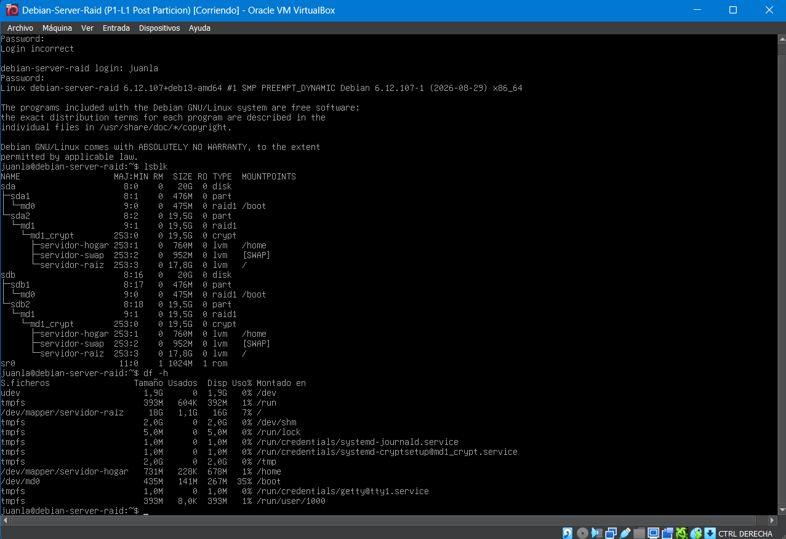

-Práctica 1

En este documento se detallarán los resultados obtenidos en la práctica 1 de la asignatura, en esta práctica se nos pedía 
utilizar el programa VirtualBox de Oracle para instalar y configurar una máquina virtual con Debian13 en nuestros dispositivos,
además se nos pedía configurar y crear distintas particiones para poder simular un sistema Raid1, añadiendo un cifrado, del mismo modo que se nos pedía
crear espacios para los cuales se usó LVM lo que nos permite tener lugar para home swap y / como se nos había indicado y que estos espacios puedan
ser más flexibles y podamos adaptar el espacio según las necesidades reales de nuestro entorno.

A continuación se expone la salida del resultado de ejecutar los comandos lsblk y df -h los cuales nos permiten listar la estructura física
y lógica del sistema (list block devices) y mostrar el espacio libre y ocupado de los sistemas de archivos (disk free)

En la salida podemos ver dos discos físicos de 20 GB sda y sdb ambos con una partición de 500 MB y otra de 19,5GB, en md0 tenemos un volumen de 500MB
destinado para el arranque boot mientras que en md1 volumen el cual está cifrado nos encontramos las tres particiones virtuales comentadas con anterioridad 
con unos espacios de 760MB para home, 952MB para SWAP y 17,8GB para la raíz.
