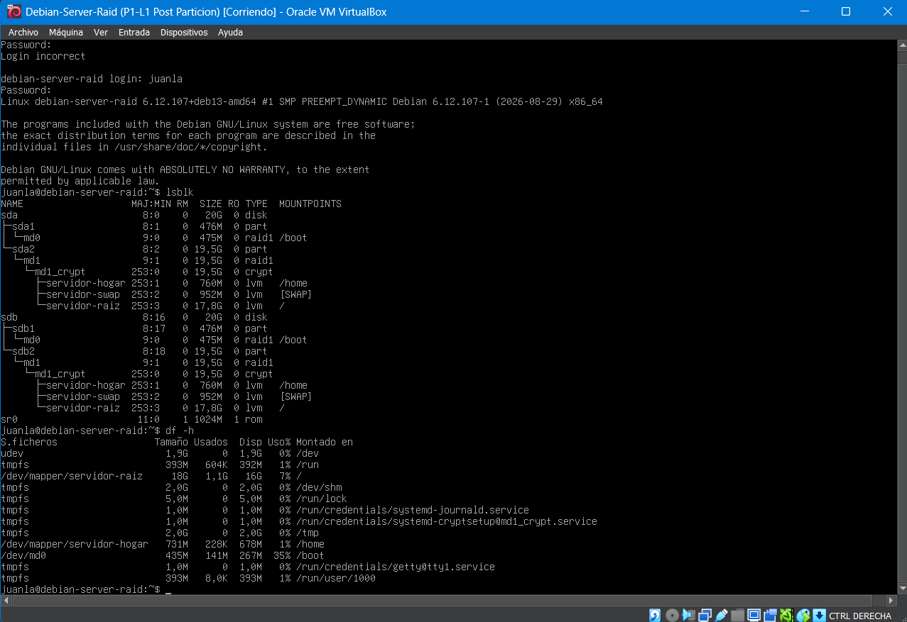

-Práctica 1-1

En este documento se detallarán los resultados obtenidos en la práctica 1 de la asignatura, en esta práctica se nos pedía 
utilizar el programa VirtualBox de Oracle para instalar y configurar una máquina virtual con Debian13 en nuestros dispositivos,
además se nos pedía configurar y crear distintas particiones para poder simular un sistema Raid1, añadiendo un cifrado, del mismo modo que se nos pedía
crear espacios para los cuales se usó LVM lo que nos permite tener lugar para home swap y / como se nos había indicado y que estos espacios puedan
ser más flexibles y podamos adaptar el espacio según las necesidades reales de nuestro entorno.

A continuación se expone la salida del resultado de ejecutar los comandos lsblk y df -h los cuales nos permiten listar la estructura física
y lógica del sistema (list block devices) y mostrar el espacio libre y ocupado de los sistemas de archivos (disk free)

En la salida podemos ver dos discos físicos de 20 GB sda y sdb ambos con una partición de 500 MB y otra de 19,5GB, en md0 tenemos un volumen de 500MB
destinado para el arranque boot mientras que en md1 volumen el cual está cifrado nos encontramos las tres particiones virtuales comentadas con anterioridad 
con unos espacios de 760MB para home, 952MB para SWAP y 17,8GB para la raíz.

-Práctica 1-2

En esta práctica se ha configurado un servidor de Alma Linux, hemos realizado una instalación
por defecto como se prevé que utilizaremos más espacio en /var por lo que decidimos asignarle un
volumen lógico en un disco nuevo.
Lo primero que se ha hecho es crear una partición con fdisk en /dev/sdb, a continuación se crea el volumen físico con pvcreate /dev/sdb1 seguido de un vgextend para extender el grupo de volumenes 
almalinux.
Ahora lo que haremos será crear el volumen lógico usando lvcreate -n newvar -L 4G almalinux
al que asignamos un tamaño de 4GB y nombramos como newvar, después se procede a montar el sistema
de ficheros en /var para lo que crearemos el sistema de ficheros del LV usando:
mkfs -t ext4 1024 /dev/almalinux/newvar y esos bloques de 1k se redimensionan para que sean de 4k
usando el comando mke2fs /dev/almalinux/newvar -b 4k, ahora crearemos un directorio temporal y
montaremos el LV ahí, a continuación hacemos un systemctl isolate rescue para mayor seguridad 
y copiamos el contenido actual de /var usando cp -a /var/. /newvar/, desmontamos con umount
/dev/almalinux/newvar hacemos mv /var /varold y un posterior mkdir /var, ahora utilizando vi
añadiremos una línea en /etc/fstab de la siguiente forma:
/dev/mapper/almalinux-newvar  /var  ext4  defaults  0 0
Para después montar lo definido en fstab con mount -a, finalmente ya podemos reiniciar con
systemctl reboot y comprobar los resultados finales con lsblk y df -h

